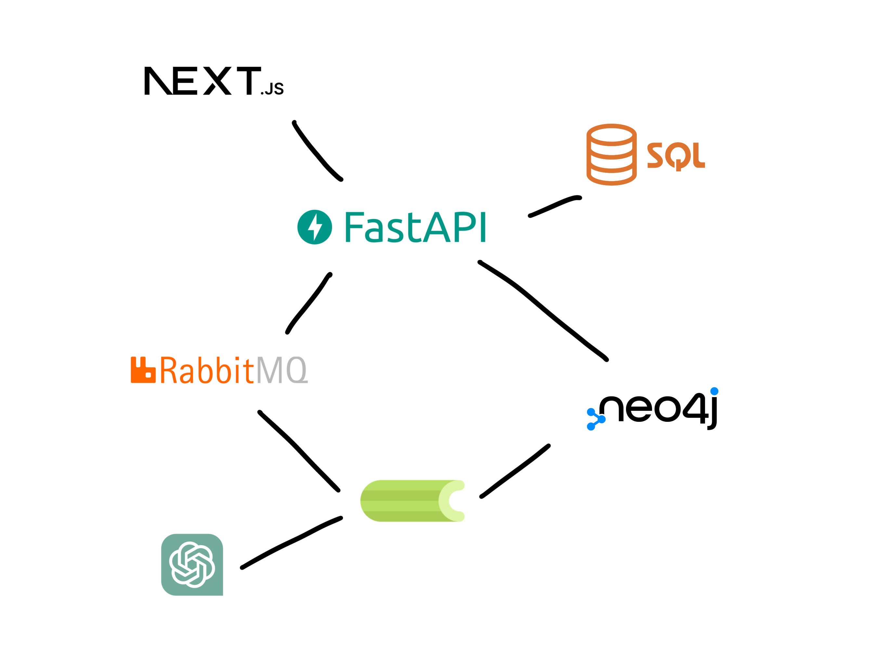
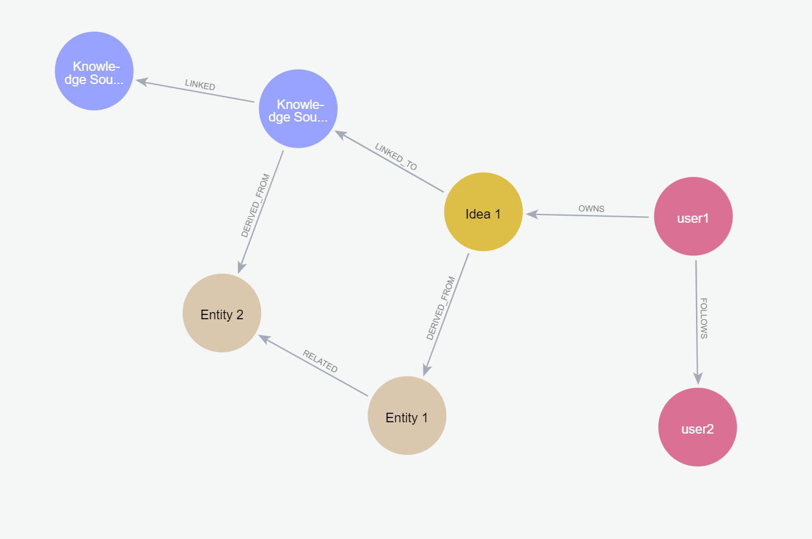

# IdeaLog Project
**Idea**Log  is an application designed to capture, track, and organize research ideas, experiments, and projects. It provides users with a platform to build relationships between various objects such as ideas, papers, experiments, and sketches. The goal is to create a comprehensive knowledge graph of interconnected ideas and resources.

## Technology Stack and Features

- ⚡ [**FastAPI**](https://fastapi.tiangolo.com) for the Python backend API.
    - 🧰 [SQLModel](https://sqlmodel.tiangolo.com) for the Python SQL database interactions (ORM).
    - 🔍 [Pydantic](https://docs.pydantic.dev), used by FastAPI, for the data validation and settings management.
    - 💾 [PostgreSQL](https://www.postgresql.org) as the SQL database.
    - 🛜 [Neo4j](https://neo4j.com/) as the graph database.
- 🚀 [React](https://react.dev) for the frontend.
    - 💃 Built using [Next.js](https://nextjs.org/) framework.
    - 🦇 Dark mode support.
- 🐋 [Docker Compose](https://www.docker.com) for development and production.
- 🔒 Secure password hashing.
- 🔑 JWT (JSON Web Token) authentication.
- 📫 Email based password recovery.
- ✅ Tests with [Pytest](https://pytest.org) and [Vitest](https://vitest.dev/).
- 🚢 Deployment instructions using Docker Compose proxy to handle automatic HTTPS certificates.
- 🏭 CI (continuous integration) and CD (continuous deployment) based on GitHub Actions.

## System Design Overview


*System Architecture Diagram: Integrating Next.js frontend with FastAPI backend, utilizing SQL and Neo4j databases, RabbitMQ for messaging, Celery for task queue management, and OpenAI for advanced language processing.*

## Graph Database Design


*Graph Model Diagram.*

User -->|OWNS| Idea

User -->|FOLLOWS| User

Idea -->|LINKED_TO| Idea

Idea -->|LINKED_TO| Knowledge Source

Knowledge Source -->|LINKED_TO| Knowledge Source

Idea -->|DERIVED_FROM| Entity

Knowledge Source -->|DERIVED_FROM| Entity

Entity -->|RELATED| Entity

## Getting Started
Download Docker Desktop for Windows. Docker Compose will be automatically installed.

Run in this directory to build and run the app:

```
docker compose up
```

## Test
```
pip install pytest
pytest
```
## Development
General development docs: [development.md](./development.md).

This includes using Docker Compose, custom local domains, `.env` configurations, etc.

## Release Notes

Check the file [release-notes.md](./release-notes.md).

## License

The IdeaLog API Project is licensed under the terms of the MIT license.