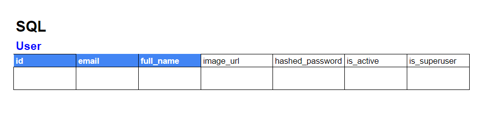
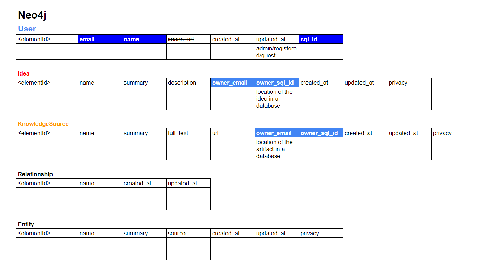

## SQL and Graph Database Schema

The IdeaLog project utilizes a hybrid approach by integrating SQL and Neo4j databases, each serving distinct purposes within the application. This combination allows the system to leverage the strengths of both relational and graph databases.

- **SQL Database:** SQL is employed primarily for structured data storage, focusing on user information, authentication, and other transactional data. The relational model is well-suited for this task, providing robust querying capabilities and ensuring data consistency through ACID (Atomicity, Consistency, Isolation, Durability) properties.

- **Neo4j Database:** Neo4j, a graph-native database, excels in storing and querying data that is inherently connected, such as knowledge graphs. It allows for efficient traversal and exploration of relationships between entities, making it ideal for representing complex networks of ideas, experiments, papers, and other research artifacts.

The following diagrams illustrate the schema and relationships for both databases. Relationships are visually distinguished using colors for clarity.

*SQL database schema.*

In the SQL schema, you'll notice tables dedicated to user management (`users`), authentication tokens, and other core entities that require structured storage and transactional integrity. Each table is designed with specific fields and constraints to enforce data validity.

*Neo4j objects and their properties.*

The Neo4j schema represents the key objects (`Idea`, `Knowledge Source`, `Entity`) and their properties, focusing on how these objects are interconnected. This schema enables powerful graph queries to explore relationships, dependencies, and the overall structure of the knowledge graph.

## Graph Database Design

The design of the Neo4j graph database is centered around the relationships between users, ideas, knowledge sources, and entities. This model allows for rich semantic connections, enabling users to uncover insights and connections that might not be immediately apparent in a traditional relational database.

*Graph Model Diagram.*

Below is a detailed breakdown of the relationships between the core entities in the graph database:

- **User** -->|OWNS| **Idea**: A user can own or create multiple ideas. This relationship signifies authorship or ownership.
- **User** -->|FOLLOWS| **User**: Users can follow other users to keep track of their ideas and contributions, fostering collaboration and knowledge sharing.
- **Idea** -->|LINKED_TO| **Idea**: Ideas can be linked to other ideas, representing direct relationships, dependencies, or inspirations between different concepts.
- **Idea** -->|LINKED_TO| **Knowledge Source**: An idea may be supported or inspired by one or more knowledge sources, such as research papers, books, or articles.
- **Knowledge Source** -->|LINKED_TO| **Knowledge Source**: Knowledge sources can be interrelated, indicating references, citations, or thematic connections.
- **Idea** -->|DERIVED_FROM| **Entity**: An idea may be derived from one or more entities, such as specific experiments, datasets, or concepts.
- **Knowledge Source** -->|DERIVED_FROM| **Entity**: Similarly, a knowledge source may be based on or derived from one or more entities, emphasizing the origin of the information.
- **Entity** -->|RELATED| **Entity**: Entities can be related to one another, highlighting connections between different research elements, such as experiments linked by a common dataset or a shared hypothesis.

This graph-based approach provides a flexible and scalable way to manage and explore the rich, interconnected data inherent in research projects, making it easier for users to navigate and build upon existing knowledge.
