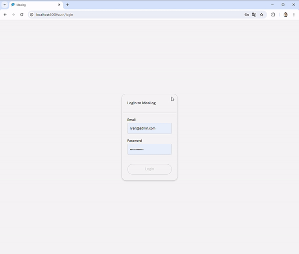
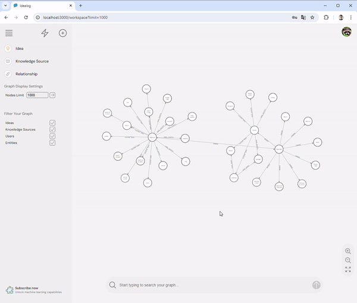
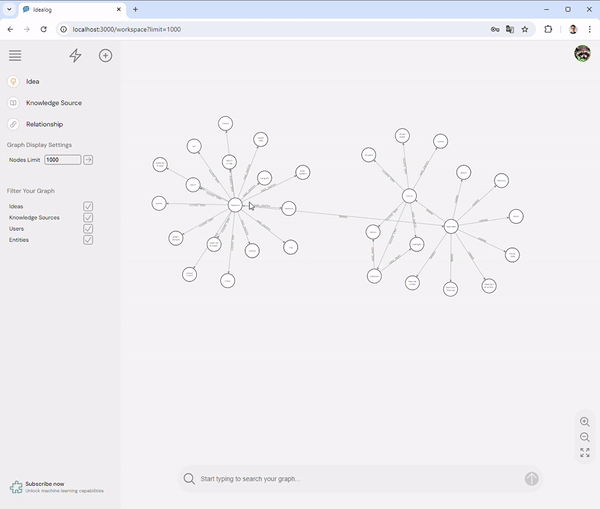
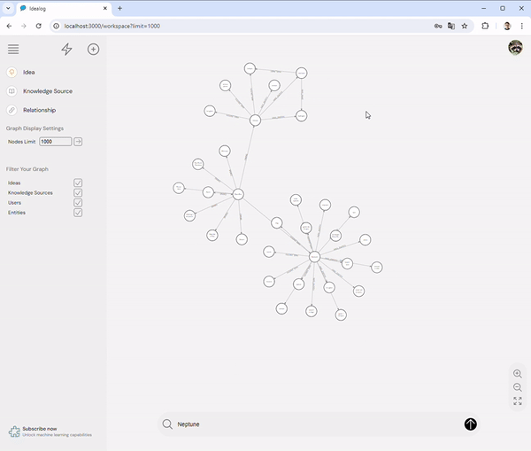
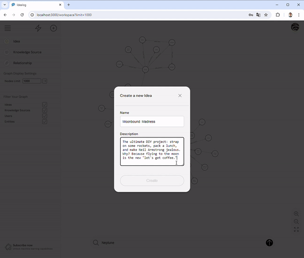
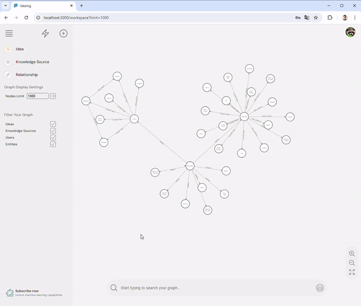
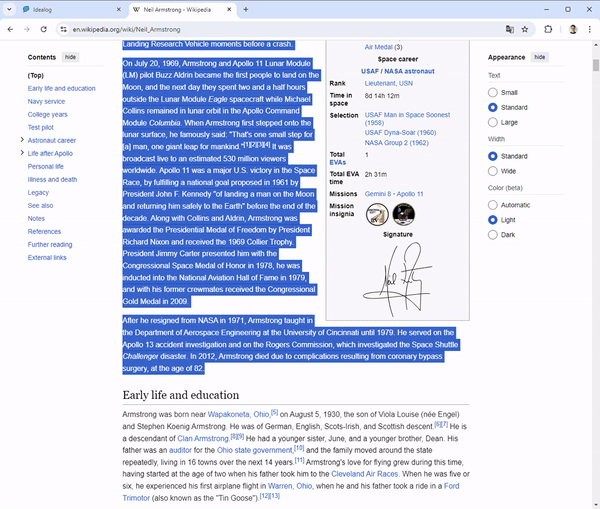

# IdeaLog User Flows

This section provides an overview of the key user interactions within the IdeaLog application, illustrated through a series of animated GIFs. Each user flow highlights a specific functionality, guiding users through the steps required to utilize the system effectively.

*Idealog login.*

wo- **Login Flow:** The login process allows users to securely access their accounts. The flow includes entering credentials, such as username and password, and handling authentication via JWT tokens. Upon successful login, users are redirected to the workspace, where they can manage their ideas and research projects.

*Node count limit feature.*

- **Node Count Limit Feature:** This feature enforces a maximum limit on the number of nodes to be displayed in the workspace.

*Node details.*

- **Node Details View:** Users can explore detailed information about individual nodes within the knowledge graph. This includes metadata, relationships with other nodes, and any associated entities or knowledge sources. The detailed view facilitates in-depth analysis and understanding of the interconnected data.

*Create a new idea 1.*

- **Creating a New Idea (Step 1):** This flow demonstrates the initial steps for creating a new idea within the platform. Users start by providing basic information about the idea, such as its title and description, before moving on to more advanced settings.

*Create a new idea 2.*

- **Creating a New Idea (Step 2):** The second part of the idea creation process allows users to define relationships between the new idea and existing entities or knowledge sources. This step is crucial for integrating the idea into the broader knowledge graph.

*Searchbar.*

- **Searchbar Functionality:** The search bar provides users with a quick and efficient way to locate specific ideas, entities, or knowledge sources within the application. It supports keyword searches and offers suggestions based on user input, enhancing navigation and discoverability.

*Create a new knowledge source with ML entity and relationships processing.*

- **Creating a New Knowledge Source with ML:** This flow showcases the advanced functionality of creating a new knowledge source, with the added capability of machine learning-driven entity and relationship processing. The system automatically identifies and links relevant entities, simplifying the process of integrating new knowledge into the graph.

---

These user flows highlight the core functionalities of the IdeaLog application, providing users with a seamless and intuitive experience as they manage their research projects and explore interconnected ideas.
